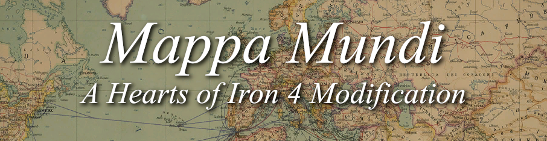

**How to install this trainwreck - presented by the Mappa Mundi team**
1) Download the mod, check your download directory (usually ThisPC/Downloads)
2) Unzip the modfile. Make sure the folder name is still MappaMundi, and if isn't rename it.
3) Enter the folder, Take out the .MOD file (the file called mappamundi.mod) and put it outside the folder into whatever directory you downloaded the mod into.
4) Hold control, and click the folder and the .MOD file and press copy
5) Go to documents/Paradox Interactive/Hearts of Iron 4/mod and paste it into the mod folder.
6) Boot up HOI4, click "Manage Playset, then click "Add More Mods" 
7) Select Mappa Mundi - Github Version and click "Add to Playset"
8) Search for Mappa Mundi - Github Version and activate the mod.
9) Play the mod and enjoy.
---------------
**Extra notes:**

- the reason why you have to rename the folder to MappaMundi is because the game won't read the mod folder if it isn't the same name as the .MOD file.
- don't expect every version to not be a buggy mess. as OCD-pleasing the mod may be, it's not bug-pleasing.
---------------
**Credits:**
 - Faaz Noushad, Nozza, Jingo Spunk, egg138, Esotericist, Linus Tip Taps, Elizabeth Großbrandt, & al-Pioneer 
 
 - Special thanks to some of those who have worked with us in the past, including: Gaffate, Bonkey Donk, schloky, RicardoPetro, Limfjorden, Marblistic, Zooptyx, scrylveon, ciel, birdirdirbirb, Der Hauptmann, Giannis, Exocamp, Volksmarine, MaiNai, snoekbaars, Sikyk, twotle, MihalRacovita, TrueSoviet, Holy Doggo, JoshyFlip, SamFan2, blue69982, Gindisi, Kels, and K0rhan.
 - Special thanks to gerrade for letting us build off of his mod, Beautiful States.
 - Special thanks to Cifotis and MrLukeNL for their work on the South Pacific.
 - Special thanks to ChaosRobie for his work on Antarctica.
 - Special thanks to Chupachu for his Country Generator Tool.
 - Special thanks to the Toolpack team for allowing us to include it directly in our mod.
 - Special thanks to Kai for allowing us to include a modified Country Colour and Skin Changer Tool.
 - Special thanks to Supermob1 for his extensive work on both the map and the scripted GUI.
 - Special thanks to Natt and the EYWOR team for their work on Asia.
 - Special thanks to Yan Xishan, ainsley, and the Gigamap team for their resources in China.
 - Special thanks to the Kaiserreich team for allowing us to use the code for their States and Victory Point Renaming System.
 - Special thanks to the Southern Victory mod team for letting us use some of their portraits. 
 - Special thanks to the Kaiserredux team for letting us use some of their flags.
